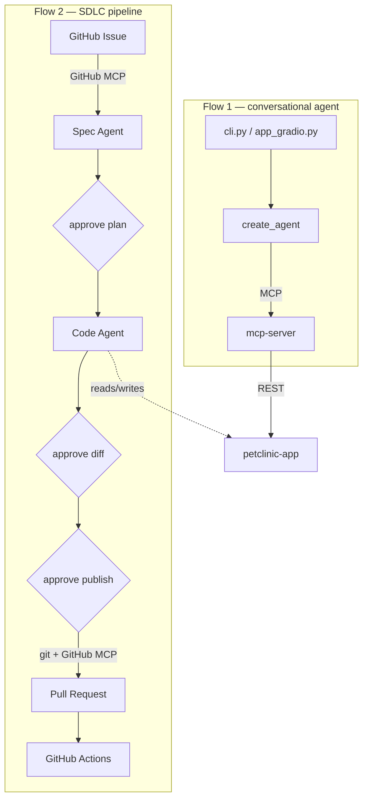

# AI-Native PetClinic

A Spring Boot application, extended two ways: an MCP server that lets an LLM
agent *use* it on a person's behalf, and an agentic pipeline that lets an LLM
*change its code*, from a GitHub issue to a reviewed, merged pull request.

Built on top of [`spring-projects/spring-petclinic`](https://github.com/spring-projects/spring-petclinic),
chosen deliberately for its small, well-understood domain — the interesting
work here is the two systems built around it, not the app itself.

## Flow 1: an agent that operates the app

`mcp-server` is a Java service that wraps `petclinic-app`'s REST API and exposes it to LLM agents over MCP: finding an owner, adding a pet, scheduling a visit are all just tool calls away.  
It holds no business logic of its own: its only job is translating between MCP's protocol and plain REST calls, using Spring AI's MCP server starter to handle the protocol side and a plain `RestClient` to call petclinic-app's REST APIs.

On top of this `mcp-server` sits a conversational agent (LangChain's `create_agent`) that turns natural language into the right tool calls - no IDs, no manual steps:

- *"Find owner Franklin and list his pets"* → `findOwners`, reads pets straight from the result
- *"Add a new owner Sparsh Girdhar, address..."* → `createOwner`
- *"Add a dog named Coco for Sparsh Girdhar"* → `createPet`, resolving "dog" to the right pet type ID itself
- *"Schedule a visit for Coco on 20th December 2026"* → `createVisit`, resolving the owner and pet names to their IDs first
- *"What visits does Leo have coming up?"* → `getVisits`

Give it a bad date and it corrects itself instead of failing. Full details in: [`docs/conversational-agent.md`](docs/conversational-agent.md).

```bash
cd petclinic-app && ./mvnw spring-boot:run   # Starts the Spring Boot backend on :8080

cd mcp-server && ./mvnw spring-boot:run      # Starts the Java MCP server on :8081

cd agent-pipeline                            # The Python side

python -m venv .venv                         # Creates an isolated Python environment
source .venv/bin/activate                    # Activates it (Windows: .venv\Scripts\activate)

pip install -e .                             # Installs deps + registers agent_pipeline as
                                              # a package, via pyproject.toml — makes
                                              # `python -m agent_pipeline...` work from
                                              # anywhere. requirements.txt is redundant
                                              # with this, safe to ignore or delete.

cp .env.example .env                         # Then fill in OPENAI_API_KEY

python -m agent_pipeline.cli                 # Terminal chat
# or
python -m agent_pipeline.app_gradio          # Browser chat UI instead
```

## Flow 2: an agent that changes the app

The SDLC pipeline turns a GitHub issue into a pull request:
- Spec agent reads the issue, proposes a bounded plan → **human approves before any code is written.**
- Code agent implements it → **human reviews the diff before it's saved to disk.**
- Result gets branched, committed, opened as a real PR → **human approves before anything is pushed.**

It's deliberately not an open-ended coding agent. The spec agent picks from a fixed menu of nine known files rather than exploring the whole repository, and the code agent generates a complete file in a single call rather than exploring or iterating over multiple turns — a tradeoff that trades some autonomy for lower cost and every change staying auditable, using `gpt-4.1-mini` throughout with no frontier model required. Full details in: [`docs/sdlc-pipeline.md`](docs/sdlc-pipeline.md).

```bash
cd agent-pipeline                            # Same project, same Python environment —
                                              # if you already ran the setup above for
                                              # the conversational agent, no need to
                                              # recreate the venv or reinstall deps

cp .env.example .env                         # Skip if you already have a .env from
                                              # Flow 1 — just add GITHUB_PERSONAL_ACCESS_TOKEN
                                              # to it (fine-grained PAT: Issues Read-only,
                                              # Pull requests Read/write, Contents Read-only)

python -m agent_pipeline.sdlc.run_sdlc \
  --owner <you> --repo <repo> --issue <n>    # <you> = your GitHub username/org,
                                              # <repo> = this repo's name,
                                              # <n> = a real issue number, scoped to one
                                              # of the 9 files in schemas.py's
                                              # ALLOWED_TARGET_FILES

                                              # Runs through: fetch issue → propose spec
                                              # (approve/reject) → generate code → show
                                              # diff (approve/reject) → auto-format →
                                              # branch/commit/push/open PR (approve/reject)
```

## Architecture



## Layout

```
petclinic-app/      Spring Boot app + REST API layer
mcp-server/         MCP server exposing petclinic-app to the conversational agent
agent-pipeline/     agent.py / cli.py / app_gradio.py   — conversational agent
                    sdlc/                               — SDLC pipeline
docs/               Full write-up of each flow
```

## Why it's built this way

**No Filesystem MCP for local file access:** The spec agent already decides
which files to touch before the code agent runs — there's no multi-turn
exploration for an MCP tool to add value to, so plain file I/O does the job
without the protocol overhead.

**GitHub MCP is scoped to two tools, not the full toolset:** Its complete
schema costs real context tokens; using only what's needed keeps the
pipeline's own budget under control.

## Not yet built

An automated CI-failure retry loop, automatic (rather than manual) build
validation between the diff and publish gates, and a RAG layer over project
docs — all deliberate v1 scope cuts.
