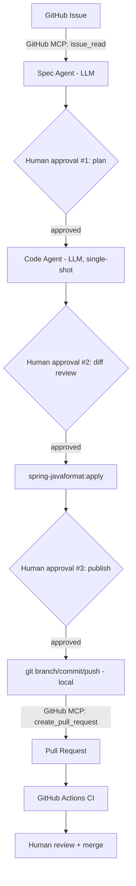

# Flow 2: SDLC pipeline

Turns a GitHub issue into a reviewed, tested, merged pull request — with a
human approval gate at every step that matters. Uses GitHub's official hosted
MCP server directly; no custom MCP server was built for this flow.

## Architecture



## Why it's deliberately bounded, not open-ended

The Code Agent never explores the repository. The Spec Agent picks from a
fixed, known menu of 9 files — 5 REST controllers + 4 core domain entities —
and the Code Agent only ever sees the one file it's told to edit, generating
its complete replacement in a single LLM call. This was a conscious tradeoff
against a fully autonomous "let the agent roam the codebase" design, made for
cost and predictability: it keeps every change auditable via diff, and keeps
the model requirement modest (`gpt-4.1-mini` throughout — no frontier model
needed for any stage).

## The three approval gates

| Gate | Stops... |
|---|---|
| 1. Plan approval | A bad *idea* — wrong file, wrong scope — before any code exists |
| 2. Diff review | Bad *code* before it touches disk |
| 3. Publish approval | A good change from shipping without a final deliberate yes |

## Where LLM / MCP / plain code are each used, and why

- **LLM** — exactly twice, both single-shot, no tool-calling loop: issue text
  → structured spec (`spec_agent.py`), and spec + current file → new file
  content (`code_agent.py`). Judgment calls only.
- **MCP** — exactly twice, both against GitHub: `issue_read` and
  `create_pull_request` (`github_client.py`, `pr_ops.py`). Used only where an
  external system's API is the only way to get the data or take the action —
  everything else (git, Maven) stayed as plain deterministic scripts, since
  there was no decision-making for an MCP tool to add value to.
- **Plain Python** — budget validation (`schemas.py`), diff generation,
  file I/O, `git`/`mvn` subprocess calls (`git_ops.py`, and the formatting
  step in `run_sdlc.py`).

## Real bugs this pipeline caught, and how they were fixed

Kept deliberately — catching these *is* the point, and each required a
different kind of fix, not just "regenerate and hope":

1. **Invalid relative-path routing** (`@GetMapping("/../../owners/...")`) —
   Spring doesn't resolve `..` in route paths; this silently produces a broken
   route, not the intended one. Root cause: the Spec Agent picked a controller
   whose class-level `@RequestMapping` structurally couldn't host the new
   route. **Fix:** taught the Spec Agent each controller's actual mapping
   prefix, with a hard rule against path-escape tricks.
2. **Hallucinated import package** — `org.springframework.samples.petclinic.visit.Visit`,
   which doesn't exist (`Visit` actually lives in the `.owner` package). The
   Code Agent only sees the one file it's editing, so it guessed a package for
   a type it needed but couldn't see. **Fix:** explicitly listed known domain
   classes and their real packages in the code-gen prompt.
3. **Unused import left in generated code** — this project's
   `spring-javaformat` checkstyle config treats that as a build failure, not a
   warning. **Fix:** explicit "don't add unused imports" rule.
4. **Silent data-integrity bug** — a generated pet-deletion endpoint compiled,
   passed a casual review, and returned `204 No Content` — but without
   `orphanRemoval = true` on `Owner`'s JPA mapping, it only nulled the pet's
   foreign key rather than deleting the row, leaving an orphaned row behind.
   A controller-only fix was structurally impossible. **Fix:** deliberately
   widened the allowed-file scope to include the domain entity (with an
   explicit "smallest possible change" caution, given the wider blast radius),
   and taught the agent the specific cascade/orphanRemoval distinction.
5. **Hallucinated repository method** — generated code called
   `types.findVisitCountsByPetType()`, a method that doesn't exist, on a
   repository whose actual interface was never shown to the Code Agent. It
   assumed a convenient method existed rather than computing the aggregate
   itself. **Fix:** an explicit rule against calling any repository method not
   already visible in the current file, with an instruction to inject an
   additional known repository (e.g. `OwnerRepository`) and compute the
   result in plain Java instead of assuming a matching query method exists.

Each fix targeted the *prompt*, not the output — the goal throughout was
making the same mistake structurally less likely to recur, not patching one
bad file by hand.

## Running it

```bash
cd petclinic-app && ./mvnw spring-boot:run   # only needed for the optional
                                               # manual `mvn compile` check —
                                               # the pipeline itself doesn't
                                               # need it running

cd agent-pipeline
pip install -e .
cp .env.example .env   # fill in OPENAI_API_KEY, GITHUB_PERSONAL_ACCESS_TOKEN

python -m agent_pipeline.sdlc.run_sdlc \
  --owner <your-github-username> --repo <repo-name> --issue <issue-number>
```

Create a GitHub issue scoped to one of the 9 allowed files first (see
`schemas.py`'s `ALLOWED_TARGET_FILES` for the exact list and each file's
routing prefix / responsibility).

## Known v1 limitations

- No automated CI-failure diagnose-and-retry loop — if CI fails after a PR
  opens, the pipeline stops and hands off to a human. A deliberate scope cut
  for v1, not an oversight — see the project root README's v2 notes.
- `mvn compile`/`test` after code generation is a manual step, run by the
  human between gates 2 and 3, not an automatic gate in the pipeline itself.
- Fixed 9-file allowlist, not open repository exploration — see the root
  README's "Design decisions" for the reasoning.
